# 基于残差场景与滚动调整的微网购电及储能调控策略

## 摘要

针对光伏出力、负载及电价变化下的微网购电问题，考虑日前预测难以覆盖日内偏差，建立由确定性线性规划、残差场景随机规划和日内滚动调整组成的调控模型。在满足逐时供电与储能约束的基础上，区分计划购电、计划调整和紧急购电三类费用，并以实际运行轨迹评价策略。

针对问题一，将一天划分为144个10分钟时段，以储能侧充放电量为变量，建立含日初日末储电量相等约束的线性规划。求得全天购电量59482.70 kWh，费用35101.57元；储电量在1200—10800 kWh内变化。容量与功率的121组组合试验表明，所考察范围内费用为35056.72—40319.54元。

针对问题二，采用最近同类型日预测负载、最近五日预测光伏，以最近十日配对残差构建场景，形成共同日前计划及场景补救决策。实际运行采用受储电量和功率约束的充放电规则。在2月1日至12月31日的334天内，总费用为1370.17万元，紧急购电量为12.79万kWh。

针对问题三，按历史误差组合外部光伏预报与历史预测，在6、12、18时更新剩余时段购电计划。完整追索式方案费用为1326.66万元，较问题二降低3.18%，紧急购电量减少83.46%。消融试验中，仅在12、18时调整的方案费用最低，为1315.58万元，但紧急购电量较主方案增加，说明更新频次应结合费用和应急需求选择。

针对问题四，利用历史同类型日电价和当日已观测电价预测未来价格，以实际电价结算。日前方案与滚动方案费用分别为1440.18万元和1395.35万元，后者节约3.11%。保持日均电价的五种波动情形中，滚动方案节约率由1.17%增至4.76%。结果表明，储能调度与日内调整能够降低统计期费用和紧急购电量，更新时点的选择则需兼顾两项指标。

**关键词：**微网调控；残差场景；两阶段随机规划；滚动优化；储能调度

## 1 问题重述与分析

### 1.1 研究任务

微网通过光伏、储能和外网购电共同满足小区负载。储能可以将低价时段的电量转移至高价时段，也可吸收暂时过剩的光伏电量，但其容量、功率和能量损耗限制了转移能力。问题的关键是提前购买多少电、何时调整承诺，以及预测偏差出现后如何调度储能。

问题一给出固定电价、负载和一天的光伏预测，要求在0时确定全天计划，且日末储电量回到日初水平。问题二引入实际负载和光伏变化，普通购电按计划量付费，供电不足须以五倍现货电价紧急购电。问题三增加每日四次光伏预报，允许付费调整原计划，需判断额外预报是否值得使用。问题四进一步考虑实时电价波动，重新计算日前方案和滚动方案。各问均需给出题面指定日期、时段的购电与储能结果。

### 1.2 方法选择与研究思路

微网与主电网的经济协调属于能量管理层问题，区别于电压、频率等快速控制问题[1]。题目未提供线路阻抗或节点结构，因此本文以10分钟电量平衡建模，不引入无法识别参数的交流潮流方程。

问题一的费用和储能动态均为线性关系，线性规划可直接处理144个时段的耦合。问题二具有“先承诺、后补救”的决策顺序，采用两阶段随机规划[2]：历史残差场景保留多条偏差路径，场景平均费用对应购电费用目标，比单点预测更充分地描述不确定性，也避免按所有最坏情形安排购电。

问题三采用滚动优化：新信息到达后重新求解未来部分，已经执行的部分保持不变。该思路已有微网能量管理研究支持[3]。本文只调整购电与储能，不增加机组启停等整数决策。预测与权重选择均按时间先后进行，仅使用决策时刻以前的信息，遵循时间序列预测的滚动评价原则[4]。问题四保持原有供电模型，只扩展价格预测及结算，便于比较新增价格信息的作用。

各问采用SciPy线性规划接口[5]与HiGHS求解器，稀疏约束结构适合修正单纯形等线性规划方法[6]。图1概括四问从确定性计划到预报、价格驱动调整的递进关系。

图1 四问的模型递进与共同评价流程

图注：历史信息生成预测与场景，实际运行后再计算费用。

## 2 数据整理与建模假设

### 2.1 数据来源和时间对齐

附件1提供144个时段的电价、负载与光伏预测功率；附件2提供2025年365天的实际负载和光伏功率；附件3每天有0、6、12、18时四次预报，每次包含未来24个整点的光伏功率；附件4给出365天的实际电价。数值区域检查未发现缺失或负值，因此未对原始功率与价格做异常值删除或平滑处理。附件3的合并日期单元格按同日四次预报补齐日期标签，保留其数值不变。

设一天共有$N=144$个时段，时段$t=0,\ldots,143$对应区间$[t\Delta,(t+1)\Delta)$，其中$\Delta=1/6$小时。源表00:10和24:00分别为首、末时段的右端点；题面10:00—10:10对应数组下标60。功率统一转换为时段电量：

$$
L_{i,t}=P^L_{i,t}\Delta,\qquad G_{i,t}=P^G_{i,t}\Delta. \tag{1}
$$

仿真从1月1日以6000 kWh开始连续运行，1月份用于形成历史预测与运行状态；按结果模板要求，费用及策略比较统计2月1日至12月31日，共334天。下文“统计期”均指这334天。2月1日的储电量继承1月31日运行结果，并不重置为6000 kWh。

### 2.2 建模假设及适用范围

（1）将微网作为单节点能量系统，以10分钟电量平衡描述供需关系；忽略线路损耗、通信时延和电压约束，储能损耗由效率参数计入。

（2）充电效率和放电效率分别取0.9，即一次完整充放电的能量效率为0.81。储能不考虑自放电、寿命衰减和随荷电状态变化的效率，5000 kW功率上限在每个10分钟时段内恒定。

（3）微网不向外网售电，超过负载且无法存储的电量计为余电。问题二至四允许紧急购电补足缺口，外网供电容量按无限制处理。

（4）按附件的负载模式，将周五、周六归为低负载类，其余日期归为另一类；用决策时已获得的近期同类样本预测负载。

（5）问题三以0时原计划为调整结算基准，减购部分保留原价的50%作为违约费用；增购部分按原价的1.5倍支付。多次修订只结算各时段最终执行的版本，避免把同一时段反复修改的差额重复收费。问题四另外假设未来实际电价在决策时未知，预测电价用于优化，实际电价用于结算。

（6）问题一以储能侧电量定义充放电变量及5000 kW上限，问题二至四以微网侧电量定义变量及上限。两种计量约定的换算见第4节；各问结果按其对应边界解释。

## 3 符号说明与公共约束

| 符号 | 含义 | 单位 |
| --- | --- | --- |
| $i,t,k$ | 日期、时段及场景下标 | — |
| $N,\Delta,K$ | 日时段数、时长及场景数：144、1/6、10 | —、h、— |
| $P^L,P^G$ | 负载功率、光伏功率 | kW |
| $L,G$ | 时段负载电量、光伏电量 | kWh |
| $g^0,g^{\tau},g^{\mathrm{fin}}$ | 原计划、更新计划、最终计划购电量 | kWh |
| $c,d$ | 问题二至四的微网侧充电量、放电量 | kWh |
| $\bar c,\bar d$ | 问题一的储能侧充电量、放电量 | kWh |
| $S$ | 储能设备内部存储电量 | kWh |
| $e,z$ | 紧急购电量、未使用余电量 | kWh |
| $r,x$ | 相对原计划的减购量、增购量 | kWh |
| $\pi,\widehat\pi$ | 实际交易电价、预测电价 | 元/kWh |
| $\eta,E_{\max}$ | 单向效率0.9、时段能量上限833.3333 | —、kWh |
| $v,\epsilon$ | 终端储电价值0.42、吞吐引导系数0.001 | 元/kWh |

表1 主要符号与单位

表中功率用于预测，电量用于优化与结算。日期下标$i$在单日模型中省略；上标$k$表示场景，上标0表示0时原计划，上标$\tau$表示在时段$\tau$开始时作出的更新。预测量用帽号表示。

对问题二至四，功率上限对应时段电量上限$E_{\max}=5000\Delta=833.3333$ kWh。实际调度满足

$$
g_t+G_t+d_t+e_t=L_t+c_t+z_t,\qquad S_{t+1}=S_t+\eta c_t-d_t/\eta, \tag{2}
$$

$$
1200\le S_t\le10800,\quad 0\le c_t,d_t\le E_{\max},\quad g_t,e_t,z_t\ge0. \tag{3}
$$

其中$z_t$为光伏富余与未使用计划购电的合计电量。将其单列后，式（2）同时描述负载供给、储能交换及余电处置。

规划模型使用较窄的未来储电范围$1500\le S_t^k\le10500$，两端各保留300 kWh安全裕度；日初实测状态仍服从物理范围1200—10800 kWh。实际运行允许使用该裕度。问题二至四不施加每日首末储电量相等约束，而以$S_{i+1,0}=S_{i,144}$连接相邻日期。

## 4 问题一：确定性日前购电模型

### 4.1 线性规划的建立与求解

对给定负载和光伏预测，决定每个时段购电量$g_t$以及储能侧充、放电量$\bar c_t,\bar d_t$，使全天费用最小：

$$
\min C_1=\sum_{t=0}^{143}\pi_tg_t. \tag{4}
$$

储能侧充入$\bar c_t$需要微网提供$\bar c_t/\eta$，储能侧放出$\bar d_t$只能向微网供给$\eta\bar d_t$，故有

$$
g_t+G_t+\eta\bar d_t=L_t+\bar c_t/\eta,\qquad S_{t+1}=S_t+\bar c_t-\bar d_t. \tag{5}
$$

$$
\begin{gathered}
0\le\bar c_t,\bar d_t\le833.3333,\qquad g_t\ge0,\\
1200\le S_t\le10800,\qquad S_0=S_{144}=6000.
\end{gathered} \tag{6}
$$

该线性规划包含577个连续变量和290个等式约束。HiGHS返回最优状态，得到式（4）—（6）的全局最优解。

按微网侧换算，$c_t=\bar c_t/\eta$、$d_t=\eta\bar d_t$，上限分别为925.9259和750.0000 kWh，即5555.56和4500.00 kW。以下问题一结果统一按储能侧列示。

### 4.2 购电计划与储能运行

按题面表1、表2的格式，以下分别列出指定时段购电量、全天费用与储能充放电结果。

| 时间段 | 购电量/kWh | 时间段 | 购电量/kWh | 时间段 | 购电量/kWh |
| --- | --- | --- | --- | --- | --- |
| 10:00-10:10 | 0.00 | 12:00-12:10 | 573.01 | 14:00-14:10 | 0.00 |
| 16:00-16:10 | 445.43 | 18:00-18:10 | 531.89 | 20:00-20:10 | 0.00 |
| 全天购电量 | 59482.70 | 全天购电费/元 | 35101.57 | 计量单位 | kWh、元 |

表2 问题一指定时段购电量及全天费用

| 时间段 | 充电量 | 放电量 | 时间段 | 充电量 | 放电量 |
| --- | --- | --- | --- | --- | --- |
| 0:00-4:00 | 3966.67 | 0.00 | 4:00-8:00 | 833.33 | 7073.16 |
| 8:00-12:00 | 3975.83 | 1892.22 | 12:00-16:00 | 5090.76 | 101.22 |
| 16:00-20:00 | 0.00 | 6422.37 | 20:00-24:00 | 4800.00 | 3177.63 |
| 0:00储电量 | 6000.00 | — | 24:00储电量 | 6000.00 | — |

表3 问题一储能侧充放电及首末储电量（kWh）

图2中，储能在低价时段及光伏富余时充电，在较高电价及负载缺口出现时放电，日末恢复至6000 kWh。全天储能侧累计充、放电量均为18666.60 kWh；四小时窗口内的正充电量与正放电量来自不同时段的切换。

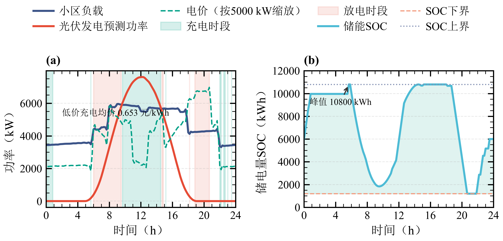

图2 问题一供需曲线与储能调控轨迹

图注：电价按5000 kW缩放；SOC表示储能内部电量。

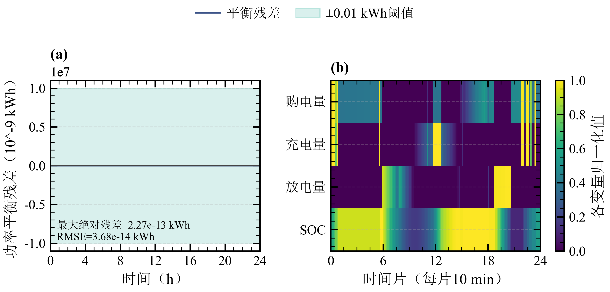

图3 问题一电量平衡与运行状态

图注：右图对每个变量分别归一化，颜色用于比较该变量的时序变化。

图3中，最大绝对电量平衡残差为$2.27\times10^{-13}$ kWh，RMSE为$3.68\times10^{-14}$ kWh。归一化热力图中充电、放电的高值区分离，与日内储电量的上升、下降相对应。

### 4.3 容量与功率灵敏度

以6000 kWh为中心，将可用储电区间写成$[6000-4800a,6000+4800a]$，其中$a=0.50,0.55,\ldots,1.00$；储能侧功率上限乘以系数$b$，取0.40、0.48、0.56、0.64、0.72、0.80、0.88、0.96、1.00、1.10、1.20。图4汇总121组容量窗口与功率系数组合的费用。

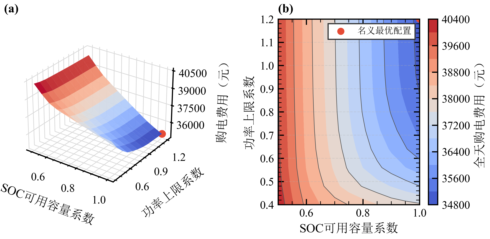

图4 可用储电窗口与功率上限对购电费的影响

图注：容量系数缩放以6000 kWh为中心的可用窗口；图中标记为所测参数网格的最低费用配置。

图4的等高线在高容量区域随功率系数增加逐渐稀疏，说明此处提高功率上限的边际节约减小。网格最低费用为35056.72元，比原参数减少44.84元；扩大可用容量窗口的影响更明显。费用随边界放宽不升，与线性规划可行域扩大的关系一致。

## 5 问题二：残差场景下的日前购电与实际调度

### 5.1 点预测和配对残差场景

负载预测取最近三个同类型日的均值，光伏预测取最近五日均值，分别记为$\widehat P^L_{i,t}$和$\widehat P^G_{i,t}$。历史不足时使用已有样本；每个历史日的残差由当时可生成的预测与实际观测之差得到。

从最近十个历史日期取配对的负载与光伏残差，形成$K=10$个等权场景：

$$
\begin{aligned}
L^k_{i,t}&=\Delta\,[\widehat P^L_{i,t}+\varepsilon^L_{h_k,t}]_+,\\
G^k_{i,t}&=\Delta\,[\widehat P^G_{i,t}+\varepsilon^G_{h_k,t}]_+,
\end{aligned}\qquad [x]_+=\max(x,0). \tag{7}
$$

同一场景的负载与光伏残差来自同一个历史日，以保留二者的共同变化及全天时序形态；生成的功率经非负截断后转为电量。图5中，2025-09-23实际净负荷落在十条场景P10—P90经验分位带内的时段占79.2%，部分午间和晚间偏差仍超出该范围。

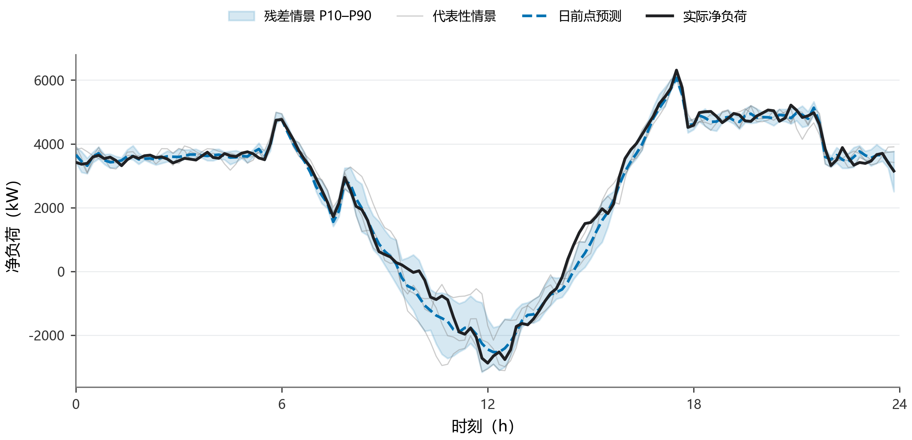

图5 典型日净负荷预测与历史残差场景

图注：阴影为十条场景的P10—P90经验分位带；净负荷为负载减光伏。

### 5.2 两阶段随机线性规划

第一阶段确定所有场景共用的购电计划$g_t$；第二阶段分别安排场景下的充放电、紧急购电和余电。以场景平均运行代价评价第一阶段计划：

$$
\min\;\sum_t\pi_tg_t+\frac1K\sum_{k=1}^K\left[5\sum_t\pi_te_t^k+\epsilon\sum_t(c_t^k+d_t^k)-vS_{144}^k\right]. \tag{8}
$$

约束为各场景的式（2）、式（3）及未来规划储电范围1500—10500 kWh，其中$\epsilon=0.001$元/kWh，$v=0.42$元/kWh。吞吐惩罚抑制无经济价值的循环，终端储电价值减轻日末过度放电；二者仅用于优化引导，实际购电费按式（11）结算。

第二阶段以完整场景路径安排补救，形成两阶段近似。实际运行逐时获得信息，并按下一节的储能规则执行；费用与紧急购电量均从实际轨迹汇总。

### 5.3 因果运行规则与结算

每个时段先接收实际负载和光伏，计算计划购电后的净缺口$R_t=L_t-G_t-g_t$。若$R_t\ge0$，优先用可用储能补足，剩余部分紧急购买：

$$
d_t=\min\{R_t,E_{\max},\eta(S_t-1200)\},\quad e_t=R_t-d_t,\quad c_t=z_t=0. \tag{9}
$$

若$R_t<0$，先在功率和容量范围内充电，其余计为余电：

$$
c_t=\min\{-R_t,E_{\max},(10800-S_t)/\eta\},\quad z_t=-R_t-c_t,\quad d_t=e_t=0. \tag{10}
$$

更新$S_{t+1}$后进入下一时段。该规则按缺口符号选择充电或放电，从执行机制上避免同一时段同时充放电。日末状态传入下一日。实际费用为

$$
C_2=\sum_{i,t}\pi_tg_{i,t}+5\sum_{i,t}\pi_te_{i,t}. \tag{11}
$$

普通购电按计划量收费，计划电量即使转为余电，也不从第一项扣除。模型通过较高的紧急购电代价与过量计划的支出之间的权衡，形成购电承诺。

### 5.4 统计期结果与典型日结果

统计期计划购电费为1292.56万元，紧急购电费为77.61万元，合计1370.17万元；紧急购电量12.79万kWh，发生于107天。负载预测MAE、RMSE分别为137.31、189.83 kW，光伏分别为151.52、304.47 kW。光伏RMSE明显较大，提示少数较大预测偏差对应较强的运行压力。

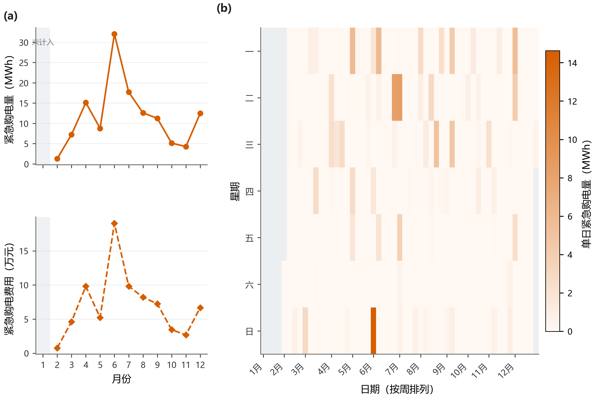

图6 统计期紧急购电的月度与逐日分布

图注：1月为预热段，不纳入费用统计。

图6显示，紧急购电在6月较为集中，少数日期形成明显峰值。因此，日前平均费用之外还需关注应急需求的时间分布，以安排储能余量。

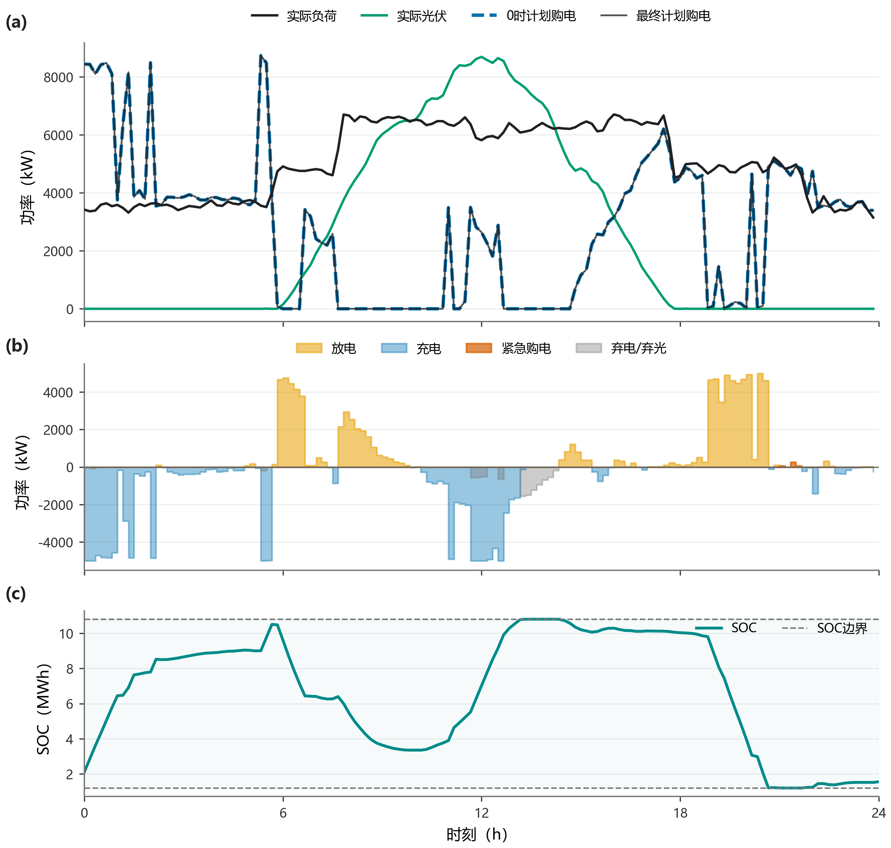

图7 问题二典型日购电与储能运行

图注：2025-09-23；购电曲线为计划购电，紧急购电另列。图中“弃电/弃光”表示全部余电。

图7进一步给出9月23日的运行过程。午间光伏富余使储能接近上边界，晚间持续放电后储能接近下边界，21时附近出现65.63 kWh紧急购电。日前计划在全天保持固定，预测偏差主要由储能吸收，超出可调能力的部分由紧急购电补足。

按题面表1—3的格式，以下列出3月20日、6月21日、9月23日和12月21日的购电、储能及紧急购电结果；储能量按微网侧计量。

| 时间段 | 购电量/kWh | 时间段 | 购电量/kWh | 时间段 | 购电量/kWh |
| --- | --- | --- | --- | --- | --- |
| 10:00–10:10 | 0.00 | 12:00–12:10 | 625.40 | 14:00–14:10 | 0.00 |
| 16:00–16:10 | 455.28 | 18:00–18:10 | 671.19 | 20:00–20:10 | 0.00 |
| 全天购电量 | 66148.82 | 全天总费用/元 | 40940.02 | 单位 | kWh、元 |

表4 问题二 2025-03-20 指定时段购电量与全天费用

| 时间段 | 充电量 | 放电量 | 时间段 | 充电量 | 放电量 |
| --- | --- | --- | --- | --- | --- |
| 00:00–04:00 | 7146.43 | 164.49 | 04:00–08:00 | 2130.64 | 4704.60 |
| 08:00–12:00 | 5033.40 | 2777.38 | 12:00–16:00 | 4620.42 | 501.13 |
| 16:00–20:00 | 34.33 | 5509.90 | 20:00–24:00 | 681.65 | 2906.81 |
| 0:00储电量 | 2541.29 | — | 24:00储电量 | 1818.69 | — |

表5 问题二 2025-03-20 储能充放电量及首末储电量（kWh）

| 时间段 | 购电量/kWh | 时间段 | 购电量/kWh | 时间段 | 购电量/kWh |
| --- | --- | --- | --- | --- | --- |
| 10:00–10:10 | 0.00 | 12:00–12:10 | 0.00 | 14:00–14:10 | 0.00 |
| 16:00–16:10 | 179.07 | 18:00–18:10 | 193.13 | 20:00–20:10 | 0.00 |
| 全天购电量 | 33335.65 | 全天总费用/元 | 19637.89 | 单位 | kWh、元 |

表6 问题二 2025-06-21 指定时段购电量与全天费用

| 时间段 | 充电量 | 放电量 | 时间段 | 充电量 | 放电量 |
| --- | --- | --- | --- | --- | --- |
| 00:00–04:00 | 425.71 | 415.84 | 04:00–08:00 | 1182.56 | 1843.75 |
| 08:00–12:00 | 10168.34 | 0.00 | 12:00–16:00 | 0.00 | 0.00 |
| 16:00–20:00 | 33.10 | 5057.02 | 20:00–24:00 | 751.22 | 2595.70 |
| 0:00储电量 | 2711.70 | — | 24:00储电量 | 3002.87 | — |

表7 问题二 2025-06-21 储能充放电量及首末储电量（kWh）

| 时间段 | 购电量/kWh | 时间段 | 购电量/kWh | 时间段 | 购电量/kWh |
| --- | --- | --- | --- | --- | --- |
| 10:00–10:10 | 0.00 | 12:00–12:10 | 439.89 | 14:00–14:10 | 0.00 |
| 16:00–16:10 | 527.13 | 18:00–18:10 | 752.85 | 20:00–20:10 | 3.63 |
| 全天购电量 | 66611.15 | 全天总费用/元 | 43062.88 | 单位 | kWh、元 |

表8 问题二 2025-09-23 指定时段购电量与全天费用

| 时间段 | 充电量 | 放电量 | 时间段 | 充电量 | 放电量 |
| --- | --- | --- | --- | --- | --- |
| 00:00–04:00 | 7572.93 | 17.01 | 04:00–08:00 | 1976.79 | 4704.25 |
| 08:00–12:00 | 4078.03 | 1896.62 | 12:00–16:00 | 4448.31 | 660.67 |
| 16:00–20:00 | 24.02 | 5699.28 | 20:00–24:00 | 498.69 | 2583.15 |
| 0:00储电量 | 2107.46 | — | 24:00储电量 | 1556.39 | — |

表9 问题二 2025-09-23 储能充放电量及首末储电量（kWh）

| 时间段 | 购电量/kWh | 时间段 | 购电量/kWh | 时间段 | 购电量/kWh |
| --- | --- | --- | --- | --- | --- |
| 10:00–10:10 | 0.00 | 12:00–12:10 | 856.43 | 14:00–14:10 | 0.00 |
| 16:00–16:10 | 813.89 | 18:00–18:10 | 678.35 | 20:00–20:10 | 0.00 |
| 全天购电量 | 94191.33 | 全天总费用/元 | 61188.39 | 单位 | kWh、元 |

表10 问题二 2025-12-21 指定时段购电量与全天费用

| 时间段 | 充电量 | 放电量 | 时间段 | 充电量 | 放电量 |
| --- | --- | --- | --- | --- | --- |
| 00:00–04:00 | 8110.27 | 183.59 | 04:00–08:00 | 2652.95 | 1604.01 |
| 08:00–12:00 | 5355.11 | 6619.39 | 12:00–16:00 | 7222.51 | 2433.99 |
| 16:00–20:00 | 56.39 | 5377.06 | 20:00–24:00 | 386.15 | 2962.32 |
| 0:00储电量 | 1823.00 | — | 24:00储电量 | 1916.51 | — |

表11 问题二 2025-12-21 储能充放电量及首末储电量（kWh）

| 03-20 | 购电量 | 06-21 | 购电量 | 09-23 | 购电量 | 12-21 | 购电量 |
| --- | --- | --- | --- | --- | --- | --- | --- |
| 无 | 0.00 | 无 | 0.00 | 21:00–21:10 | 11.80 | 无 | 0.00 |
| — | — | — | — | 21:20–21:40 | 53.83 | — | — |
| 合计 | 0.00 | 合计 | 0.00 | 合计 | 65.63 | 合计 | 0.00 |

表12 问题二四个典型日紧急购电（kWh）

## 6 问题三：预报组合与日内滚动调整

### 6.1 预报对齐、组合及当日修正

附件3的整点预报先线性插值到10分钟右端点网格。0时发布时以0作为边界锚点；6、12、18时发布时，以该时刻之前最后一个已完成时段的光伏观测为边界锚点，再连接至发布后第一个整点预报。仅提取当日剩余时段，未将次日部分纳入跨午夜的优化。

设$A_{i,t}^{\tau}$为附件3插值预报，$H_{i,t}$为历史均值预测。按最近30天同一发布时间、同一剩余时域的MAE选择组合权重：

$$
w_i^{\tau}\in\arg\min_{w\in\{0,0.1,\ldots,1\}}\frac{1}{|\mathcal H_i|(144-\tau)}\sum_{h\in\mathcal H_i}\sum_{t=\tau}^{143}\left|wA_{h,t}^{\tau}+(1-w)H_{h,t}-P^G_{h,t}\right|. \tag{12}
$$

由此得到$\widehat P_{i,t}^{G,\tau}=w_i^{\tau}A_{i,t}^{\tau}+(1-w_i^{\tau})H_{i,t}$。集合$\mathcal H_i$只含日期$i$以前的样本，权重不使用当前日剩余时段的真实光伏。

日内负载修正利用当日已观测误差。设其均值为$b$、最近一个误差为$u$，对距更新时刻第$\ell$个时段的预测采用

$$
\widehat P_{t}^{L,\tau}=\left[\widehat P_t^{L,0}+b+0.65^{\ell}(u-b)\right]_+. \tag{13}
$$

光伏修正取更新前最近一个0时组合预测大于1 kW的时段$a$，以$\kappa=P^G_a/\widehat P_a^{G,0}$表示实际出力相对原预测的比例；不存在该时段时令$\kappa=1$。按距离衰减该比例偏差：

$$
\widetilde P_t^{G,\tau}=\left[\widehat P_t^{G,\tau}\{1+(\kappa-1)0.94^{\ell}\}\right]_+. \tag{14}
$$

式（14）按实际光伏相对于0时组合预测的比例修正剩余时段，随后基于更新预测形成相应的历史残差场景。

### 6.2 原计划、调整变量与结算模型

将0时计划记为$g_t^0$。对每条场景设置减购量$r_t^k$和增购量$x_t^k$，6时以前二者固定为0，6时及以后允许追索，且$0\le r_t^k\le g_t^0$。在0时提前考虑未来可能调整的代价：

$$
\begin{aligned}
\min\;&\sum_t\pi_tg_t^0+\frac1K\sum_k\Big[\sum_t\pi_t(-0.5r_t^k+1.5x_t^k+5e_t^k)\\
&\hspace{32mm}+\epsilon\sum_t(c_t^k+d_t^k)-vS_{144}^k\Big].
\end{aligned} \tag{15}
$$

各场景电量平衡中的计划电量相应替换为$g_t^0-r_t^k+x_t^k$。式（15）的场景减购、增购代表提前评估的补救机会，实际执行的调整仍须在信息发布后重新求解。

在$\tau=36,72,108$，以当前实际储电量为初值，更新负载、光伏及残差场景，对剩余时段使用共同调整决策：

$$
g_t^{\tau}=g_t^0-r_t^{\tau}+x_t^{\tau},\qquad0\le r_t^{\tau}\le g_t^0,\quad x_t^{\tau}\ge0,\quad t\ge\tau. \tag{16}
$$

滚动目标为剩余调整费用与平均场景应急、吞吐和终端代价之和，约束与问题二相同。0时承诺费用为常数，式（16）的调整量始终以0时原计划为基准。

最终计划按实际适用时段拼接：0—6时用$g^0$，6—12时用$g^{36}$，12—18时用$g^{72}$，18—24时用$g^{108}$。记拼接结果为$g^{\mathrm{fin}}$，则总费用为

$$
\begin{aligned}
C_3&=C_{\mathrm{plan}}+C_{\mathrm{adj}}+C_{\mathrm{em}},\\
C_{\mathrm{plan}}&=\sum_{i,t}\pi_tg_{i,t}^0,\\
C_{\mathrm{adj}}&=\sum_{i,t}\pi_t\left[-0.5(g_{i,t}^0-g_{i,t}^{\mathrm{fin}})_++1.5(g_{i,t}^{\mathrm{fin}}-g_{i,t}^0)_+\right],\\
C_{\mathrm{em}}&=5\sum_{i,t}\pi_te_{i,t}.
\end{aligned} \tag{17}
$$

例如原计划100 kWh、最终80 kWh，按100倍单价计入计划费，再减去10倍单价的调整退款，等价于80 kWh购电费与20 kWh减购量的50%违约费。

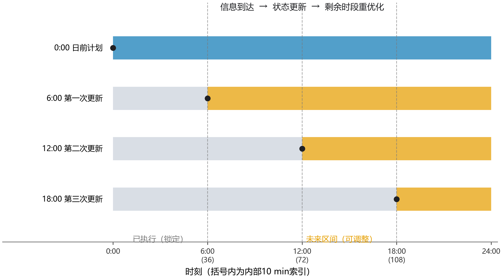

图8 问题三信息更新与剩余时段调整

图注：已执行时段锁定，每次更新以当前实测储电量为起点。

### 6.3 预报效果与运行费用

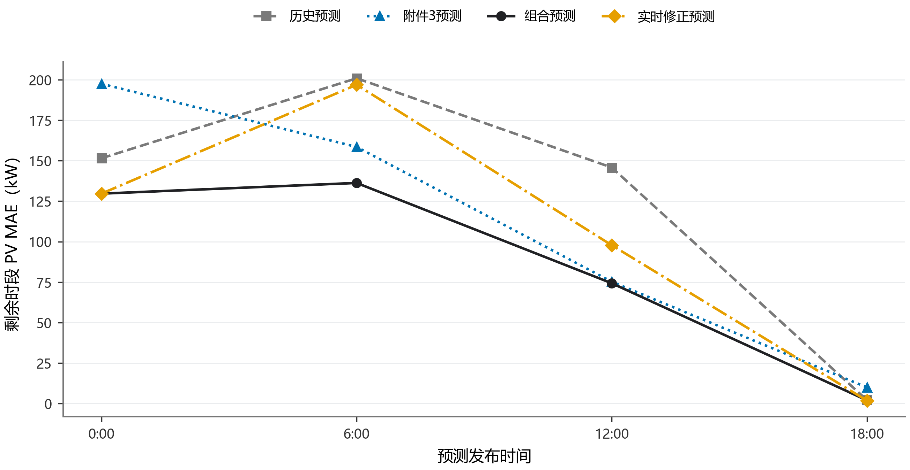

图9 各发布时间的光伏预测误差

图注：MAE按各次发布后的当日剩余时段计算。

图9中，组合预测在四个发布时间的MAE均低于直接使用附件3。比例修正却使6时MAE从136.26增至196.90 kW、12时从74.32增至97.79 kW，说明近期出力比例延伸到未来时可能放大天气偏差。18时剩余时段以低出力为主，四条误差曲线随之接近；同一发布时间下的比较更能反映方法差别。

| 指标 | 问题二 | 问题三 |
| --- | --- | --- |
| 统计天数/d | 334 | 334 |
| 计划购电费/元 | 12925565.04 | 12408349.81 |
| 调整费/元 | 0.00 | 753729.66 |
| 紧急购电费/元 | 776093.47 | 104543.26 |
| 总费用/元 | 13701658.50 | 13266622.73 |
| 0时计划购电量/kWh | 20632061.35 | 20060179.42 |
| 最终计划购电量/kWh | 20632061.35 | 20518906.35 |
| 紧急购电量/kWh | 127912.33 | 21152.53 |
| 发生紧急购电天数/d | 107 | 87 |
| 余电量/kWh | 1674121.12 | 1424175.34 |

表13 问题二与问题三主方案的统计期比较

统计期对照表显示，主方案较问题二节约43.50万元，其中计划费降低51.72万元、紧急购电费降低67.16万元，抵消了新增的75.37万元调整费。紧急购电量由127912.33降至21152.53 kWh，减少83.46%。节约来自计划、预报与执行方式共同改变后的综合效果。

统计期节约并非每天都发生：四个指定日期的主方案费用均高于问题二，具体见第6.5节的典型日结果。日内调整的付费成本与应急支出需要在完整统计期内共同评价。

### 6.4 额外发布时间的必要性

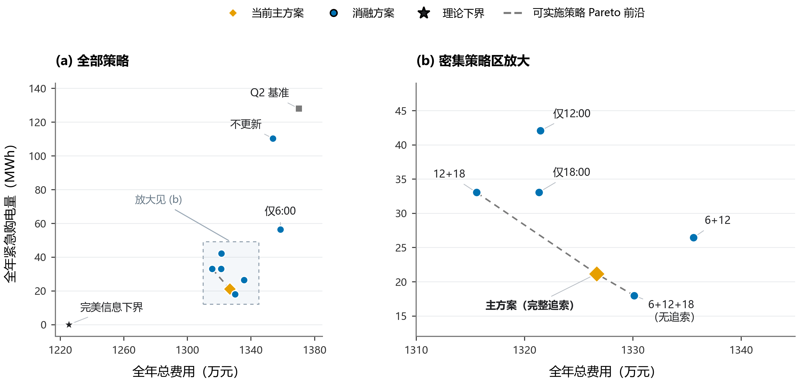

图10 滚动方案的费用与紧急购电量比较

图注：图中“理论下界”为原图对完美信息参照的标记；该参照采用逐日优化与终端价值，并非统计期费用的严格下界。

图10给出各方案的费用与紧急购电量。仅6时更新的费用高于不更新；仅12时或仅18时更新均降低费用，12、18时组合的费用最低，为1315.58万元。可实施方案的非支配前沿由12+18时、完整追索主方案及6+12+18时无追索方案构成，分别体现费用与应急需求之间的取舍。

主方案比12、18时方案多支出11.08万元，紧急购电量减少11877.23 kWh。固定6、12、18时更新后，加入日前追索使费用由1330.14降至1326.66万元，紧急购电量却从17970.87增至21152.53 kWh。因此，选择12、18时更新偏重费用目标，完整追索主方案则在较低费用与较小应急量之间折中。

上述前沿和最低费用均对应已比较的方案集合。完美信息点作为参照单独列示，不参与可实施方案前沿的计算。

### 6.5 典型日计划演化与费用比较

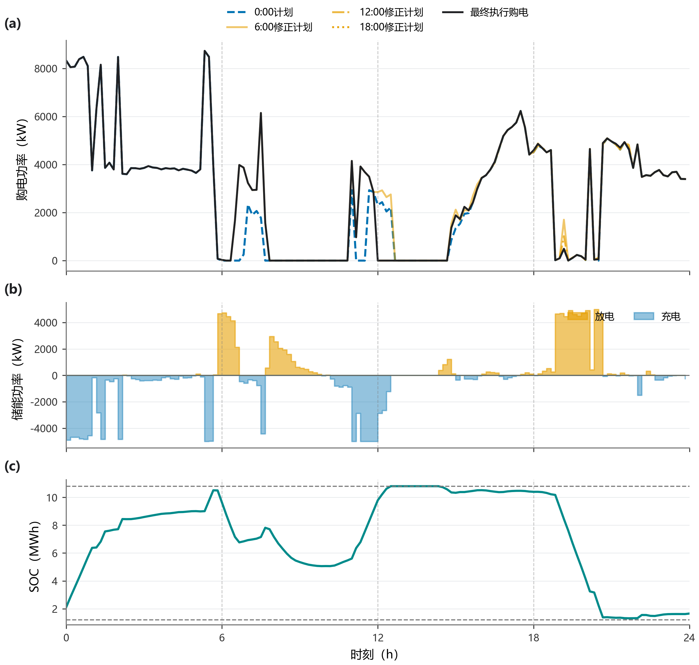

图11 问题三典型日购电计划的滚动演化

图注：2025-09-23；竖虚线为6、12、18时的信息发布时刻。

图11以9月23日为例：各次修正只延伸到发布后的时段，实线最终计划由最近一次可用方案拼接而成。午间与晚间购电量随新信息调整，储能在白天补充电量、晚间释放，晚间紧急购电由问题二的65.63 kWh降至0。

按题面表1—3的格式，以下购电表以“原计划/最终计划”列出两种购电量，储能表列出最终运行结果，并汇总四个日期的紧急购电量。

| 时间段 | 购电量/kWh | 时间段 | 购电量/kWh | 时间段 | 购电量/kWh |
| --- | --- | --- | --- | --- | --- |
| 10:00–10:10 | 0.00 / 0.00 | 12:00–12:10 | 538.09 / 618.49 | 14:00–14:10 | 0.00 / 0.00 |
| 16:00–16:10 | 538.26 / 538.26 | 18:00–18:10 | 671.19 / 679.70 | 20:00–20:10 | 0.00 / 0.00 |
| 全天购电量 | 65024.60 / 65917.49 | 全天总费用/元 | 44142.02 | 单位 | kWh、元 |

表14 问题三 2025-03-20 指定时段购电量与全天费用（原计划/最终计划）

| 时间段 | 充电量 | 放电量 | 时间段 | 充电量 | 放电量 |
| --- | --- | --- | --- | --- | --- |
| 00:00–04:00 | 7394.59 | 14.97 | 04:00–08:00 | 1829.31 | 5691.28 |
| 08:00–12:00 | 2935.78 | 2506.79 | 12:00–16:00 | 7072.08 | 255.20 |
| 16:00–20:00 | 153.57 | 5259.70 | 20:00–24:00 | 681.04 | 2717.52 |
| 0:00储电量 | 2024.09 | — | 24:00储电量 | 1811.09 | — |

表15 问题三 2025-03-20 储能充放电量及首末储电量（kWh）

| 时间段 | 购电量/kWh | 时间段 | 购电量/kWh | 时间段 | 购电量/kWh |
| --- | --- | --- | --- | --- | --- |
| 10:00–10:10 | 0.00 / 0.00 | 12:00–12:10 | 0.00 / 0.00 | 14:00–14:10 | 0.00 / 0.00 |
| 16:00–16:10 | 128.77 / 128.77 | 18:00–18:10 | 0.00 / 0.00 | 20:00–20:10 | 0.00 / 0.00 |
| 全天购电量 | 32788.93 / 33321.63 | 全天总费用/元 | 19727.57 | 单位 | kWh、元 |

表16 问题三 2025-06-21 指定时段购电量与全天费用（原计划/最终计划）

| 时间段 | 充电量 | 放电量 | 时间段 | 充电量 | 放电量 |
| --- | --- | --- | --- | --- | --- |
| 00:00–04:00 | 198.67 | 306.84 | 04:00–08:00 | 1389.78 | 1440.01 |
| 08:00–12:00 | 9670.60 | 0.00 | 12:00–16:00 | 0.00 | 0.00 |
| 16:00–20:00 | 41.50 | 5273.24 | 20:00–24:00 | 686.38 | 2623.75 |
| 0:00储电量 | 2607.81 | — | 24:00储电量 | 2680.65 | — |

表17 问题三 2025-06-21 储能充放电量及首末储电量（kWh）

| 时间段 | 购电量/kWh | 时间段 | 购电量/kWh | 时间段 | 购电量/kWh |
| --- | --- | --- | --- | --- | --- |
| 10:00–10:10 | 0.00 / 0.00 | 12:00–12:10 | 386.56 / 0.00 | 14:00–14:10 | 0.00 / 0.00 |
| 16:00–16:10 | 573.36 / 573.36 | 18:00–18:10 | 752.85 / 765.47 | 20:00–20:10 | 3.63 / 7.30 |
| 全天购电量 | 64801.74 / 68391.05 | 全天总费用/元 | 46234.62 | 单位 | kWh、元 |

表18 问题三 2025-09-23 指定时段购电量与全天费用（原计划/最终计划）

| 时间段 | 充电量 | 放电量 | 时间段 | 充电量 | 放电量 |
| --- | --- | --- | --- | --- | --- |
| 00:00–04:00 | 7513.62 | 5.55 | 04:00–08:00 | 3016.80 | 3965.15 |
| 08:00–12:00 | 5253.03 | 1896.62 | 12:00–16:00 | 1333.90 | 425.56 |
| 16:00–20:00 | 107.98 | 5807.95 | 20:00–24:00 | 479.75 | 2638.16 |
| 0:00储电量 | 2100.88 | — | 24:00储电量 | 1658.82 | — |

表19 问题三 2025-09-23 储能充放电量及首末储电量（kWh）

| 时间段 | 购电量/kWh | 时间段 | 购电量/kWh | 时间段 | 购电量/kWh |
| --- | --- | --- | --- | --- | --- |
| 10:00–10:10 | 0.00 / 0.00 | 12:00–12:10 | 894.78 / 894.78 | 14:00–14:10 | 0.00 / 0.00 |
| 16:00–16:10 | 823.30 / 847.49 | 18:00–18:10 | 666.26 / 446.98 | 20:00–20:10 | 0.00 / 0.00 |
| 全天购电量 | 93530.09 / 94363.30 | 全天总费用/元 | 61692.49 | 单位 | kWh、元 |

表20 问题三 2025-12-21 指定时段购电量与全天费用（原计划/最终计划）

| 时间段 | 充电量 | 放电量 | 时间段 | 充电量 | 放电量 |
| --- | --- | --- | --- | --- | --- |
| 00:00–04:00 | 8083.92 | 35.88 | 04:00–08:00 | 2938.42 | 1750.20 |
| 08:00–12:00 | 5069.31 | 7130.47 | 12:00–16:00 | 7958.21 | 2251.40 |
| 16:00–20:00 | 0.00 | 5621.05 | 20:00–24:00 | 413.06 | 2939.14 |
| 0:00储电量 | 1563.96 | — | 24:00储电量 | 1660.43 | — |

表21 问题三 2025-12-21 储能充放电量及首末储电量（kWh）

| 03-20 | 购电量 | 06-21 | 购电量 | 09-23 | 购电量 | 12-21 | 购电量 |
| --- | --- | --- | --- | --- | --- | --- | --- |
| 09:10–10:00 | 270.59 | 无 | 0.00 | 无 | 0.00 | 无 | 0.00 |
| 合计 | 270.59 | 合计 | 0.00 | 合计 | 0.00 | 合计 | 0.00 |

表22 问题三四个典型日紧急购电（kWh）

典型日总费用与紧急购电量变化并不一致：9月23日虽消除了紧急购电，总费用仍增加；3月20日则发生270.59 kWh紧急购电。滚动策略的统计期节约由全年各日的费用变化共同形成。

## 7 问题四：波动电价下的因果购电策略

### 7.1 价格信息与决策规则

价格波动同时改变储能转移电量的收益、紧急购电和调整成本。0时电价预测取最近三个同类型日均值$\widehat\pi_{i,t}^{0}$；历史不足时使用已有样本，最初以附件1价格启动。日内利用已观测价格的累计水平修正剩余预测：

$$
a_i^{\tau}=\frac{\sum_{t<\tau}\pi_{i,t}}{\sum_{t<\tau}\widehat\pi_{i,t}^{0}},\qquad \widehat\pi_{i,t}^{\tau}=a_i^{\tau}\widehat\pi_{i,t}^{0},\quad t\ge\tau. \tag{18}
$$

该比例改变剩余曲线的整体水平，保留其峰谷位置。问题四之二将式（8）的价格替换为0时预测价格；问题四之三还在6、12、18时更新滚动目标。两者均按附件4实际交易价格结算式（11）、式（17）的费用。

图12中，价格MAE约为0.036—0.040元/kWh，6时更新后略升、18时最低。不同发布时间的剩余样本与价格突变不同，比例修正只能调整整体水平，因此误差变化并非单调。

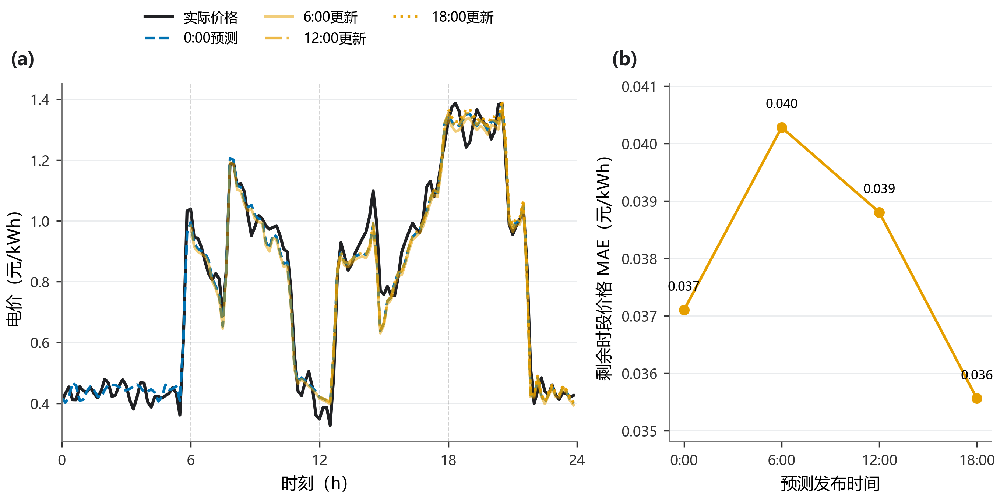

图12 典型日电价更新与统计期预测误差

图注：各次预测仅覆盖发布后的未来区间。

### 7.2 统计期费用与信息价值

| 指标 | 问题四之二 | 问题四之三 |
| --- | --- | --- |
| 统计天数/d | 334 | 334 |
| 计划购电费/元 | 13603509.03 | 13068665.06 |
| 调整费/元 | 0.00 | 766977.43 |
| 紧急购电费/元 | 798263.55 | 117818.44 |
| 总费用/元 | 14401772.58 | 13953460.93 |
| 0时计划购电量/kWh | 20642939.91 | 20090653.88 |
| 最终计划购电量/kWh | 20642939.91 | 20535635.37 |
| 紧急购电量/kWh | 126055.49 | 22900.97 |
| 发生紧急购电天数/d | 103 | 91 |
| 余电量/kWh | 1668540.82 | 1421673.17 |

表23 波动电价下两种因果方案的统计期结果

统计期因果日前与滚动方案费用分别为1440.18、1395.35万元，滚动方案节约44.83万元，即3.11%；紧急购电量从126055.49降至22900.97 kWh，减少81.83%。

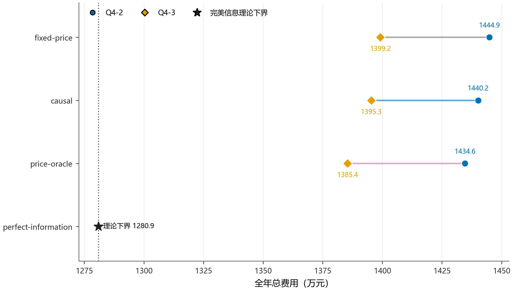

图13 不同价格信息下的日前与滚动费用

图注：各点统一按实际电价结算；price-oracle为预知电价对照，“理论下界”为与图10同义的完美信息参照。

图13区分价格信息条件：fixed-price使用附件1固定价格决策，causal使用当时可得的价格预测，price-oracle预知当天实际价格而仍预测负载与光伏；三者统一按附件4实际价格结算。相对固定价格决策，因果预测使日前、滚动方案分别节约0.33%、0.27%；进一步预知电价后，再分别节约0.39%、0.71%。本组对照中，滚动调整的费用差大于价格预测相对固定价格的费用差。

完美信息参照同时已知负载、光伏与电价，其费用为1280.93万元，用于衡量当前策略与充分信息条件下参考表现的差距。

### 7.3 价格、储能与购电的日内配合

| 日期 | 方案 | 原计划/kWh | 最终计划/kWh | 总费用/元 | 紧急购电/kWh |
| --- | --- | --- | --- | --- | --- |
| 03-20 | 日前 | 66219.79 | 66219.79 | 42083.51 | 0.00 |
| 03-20 | 滚动 | 64782.09 | 65664.91 | 45045.32 | 251.85 |
| 06-21 | 日前 | 33748.13 | 33748.13 | 17278.64 | 0.00 |
| 06-21 | 滚动 | 33488.12 | 34062.20 | 17432.29 | 0.00 |
| 09-23 | 日前 | 66834.10 | 66834.10 | 44970.74 | 67.16 |
| 09-23 | 滚动 | 64822.50 | 68353.96 | 48268.01 | 7.77 |
| 12-21 | 日前 | 84525.79 | 84525.79 | 67455.10 | 0.00 |
| 12-21 | 滚动 | 83961.70 | 84524.30 | 68102.79 | 0.00 |

表24 波动电价下典型日购电与费用汇总

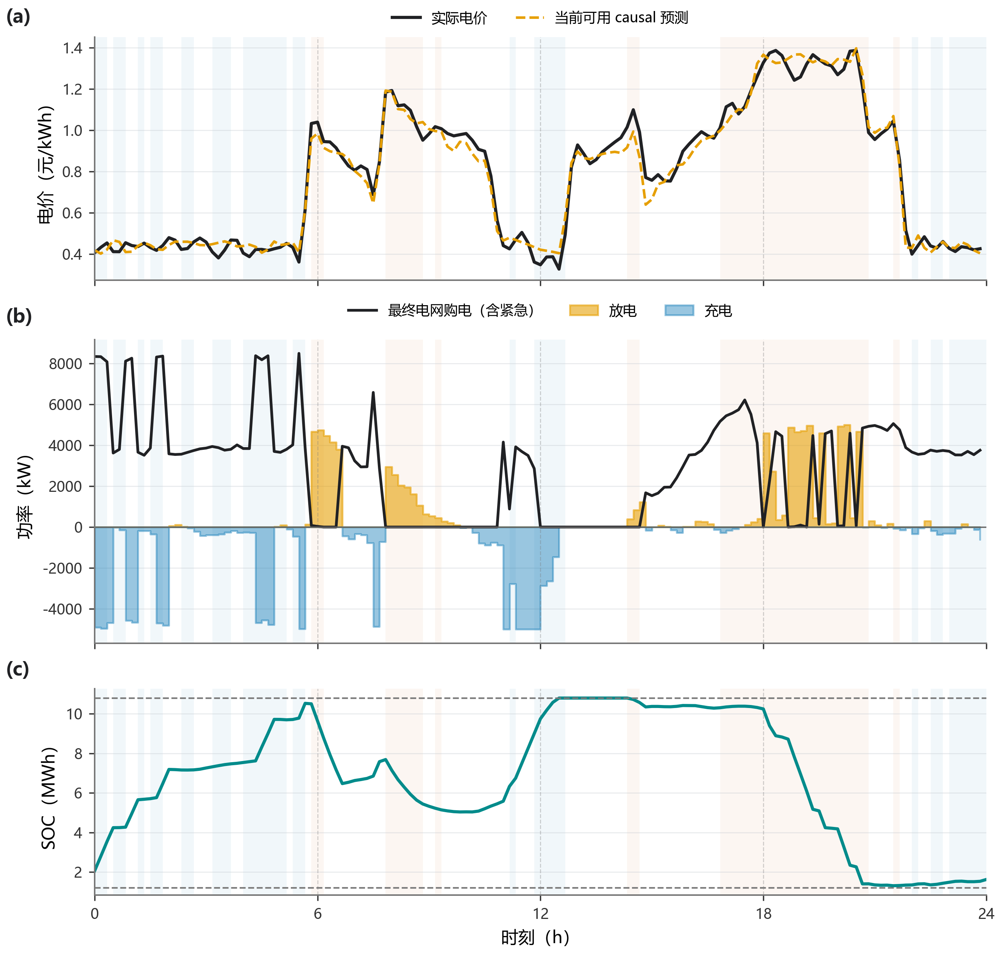

图14 波动电价下的储能与购电配合

图注：2025-09-23；最终电网购电含紧急购电。背景按实际价格P25/P75划分低/高价区间，仅作事后解释。

表中“日前”和“滚动”分别对应问题四之二、之三，四个指定日期的滚动费用均高于日前方案。图14选取9月23日，该日紧急购电由67.16降至7.77 kWh，总费用却增加3297.27元；低价充电、高价放电减少了晚间缺口，调整成本仍需一并计入费用。统计期的净节约来自其他日期的改善。

沿用题面指定日期和时段，以下将波动电价下两种方案并列，给出购电、储能及紧急购电结果。

| 时间段 | 方案 | 03-20 | 06-21 | 09-23 | 12-21 |
| --- | --- | --- | --- | --- | --- |
| 10:00–10:10 | 日前 | 0.00 | 0.00 | 0.00 | 0.00 |
| 10:00–10:10 | 滚动 | 0.00 | 0.00 | 0.00 | 0.00 |
| 12:00–12:10 | 日前 | 625.40 | 0.00 | 439.89 | 856.43 |
| 12:00–12:10 | 滚动 | 618.49 | 0.00 | 0.00 | 865.61 |
| 14:00–14:10 | 日前 | 0.00 | 0.00 | 0.00 | 0.00 |
| 14:00–14:10 | 滚动 | 0.00 | 0.00 | 0.00 | 0.00 |
| 16:00–16:10 | 日前 | 465.12 | 137.16 | 527.13 | 813.89 |
| 16:00–16:10 | 滚动 | 538.26 | 128.77 | 586.22 | 847.49 |
| 18:00–18:10 | 日前 | 671.07 | 13.22 | 0.00 | 729.95 |
| 18:00–18:10 | 滚动 | 671.07 | 0.00 | 0.00 | 439.00 |
| 20:00–20:10 | 日前 | 692.15 | 0.00 | 3.63 | 0.00 |
| 20:00–20:10 | 滚动 | 694.56 | 0.00 | 7.30 | 0.00 |

表25 波动电价下指定10分钟时段最终购电量（kWh）

| 时间段 | 方案 | 03-20 | 06-21 | 09-23 | 12-21 |
| --- | --- | --- | --- | --- | --- |
| 00:00–04:00 | 日前 | 6653.96 / 247.10 | 166.36 / 1006.41 | 6284.54 / 30.55 | 507.30 / 229.56 |
| 00:00–04:00 | 滚动 | 6642.55 / 64.13 | 216.13 / 1014.16 | 6123.17 / 27.37 | 686.52 / 225.83 |
| 04:00–08:00 | 日前 | 2694.12 / 5133.41 | 1658.56 / 1755.02 | 4136.82 / 5339.30 | 316.74 / 971.38 |
| 04:00–08:00 | 滚动 | 1920.71 / 5713.74 | 2113.23 / 1371.89 | 4697.30 / 4162.08 | 326.01 / 1215.06 |
| 08:00–12:00 | 日前 | 5100.87 / 2777.38 | 10154.81 / 0.00 | 3930.46 / 1896.62 | 5011.80 / 6682.35 |
| 08:00–12:00 | 滚动 | 2904.15 / 2525.53 | 9663.15 / 0.00 | 5237.99 / 1896.62 | 5016.64 / 7135.31 |
| 12:00–16:00 | 日前 | 4594.71 / 527.79 | 0.00 / 0.00 | 4607.12 / 645.85 | 7318.90 / 2434.25 |
| 12:00–16:00 | 滚动 | 7112.77 / 254.72 | 0.00 / 0.00 | 1263.59 / 421.50 | 8000.11 / 2251.40 |
| 16:00–20:00 | 日前 | 27.96 / 6612.76 | 59.27 / 5157.66 | 24.02 / 5705.14 | 88.40 / 5307.03 |
| 16:00–20:00 | 滚动 | 115.61 / 6197.15 | 46.92 / 5317.66 | 110.62 / 5701.61 | 0.00 / 5621.03 |
| 20:00–24:00 | 日前 | 1201.75 / 1766.24 | 1410.14 / 2621.53 | 493.21 / 2595.02 | 452.32 / 3006.59 |
| 20:00–24:00 | 滚动 | 1176.75 / 1737.37 | 1340.32 / 2659.30 | 450.37 / 2668.98 | 445.38 / 2961.01 |
| 日初 / 日末 | 日前 | 3008.05 / 2293.32 | 3086.50 / 3478.93 | 2063.73 / 1578.42 | 10408.89 / 2033.49 |
| 日初 / 日末 | 滚动 | 2719.07 / 2279.19 | 2657.91 / 3185.22 | 2061.60 / 1625.04 | 10204.32 / 1665.23 |

表26 波动电价下典型日储能量（kWh）

表注：单元格依次列出充电量与放电量；末两行为日初和日末储电量。

| 03-20 | 购电量 | 06-21 | 购电量 | 09-23 | 购电量 | 12-21 | 购电量 |
| --- | --- | --- | --- | --- | --- | --- | --- |
| 无 | 0.00 | 无 | 0.00 | 20:10–20:20 | 10.00 | 无 | 0.00 |
| — | — | — | — | 21:00–21:10 | 5.66 | — | — |
| — | — | — | — | 21:20–21:40 | 51.50 | — | — |
| 合计 | 0.00 | 合计 | 0.00 | 合计 | 67.16 | 合计 | 0.00 |

表27 问题四之二四个典型日紧急购电（kWh）

| 03-20 | 购电量 | 06-21 | 购电量 | 09-23 | 购电量 | 12-21 | 购电量 |
| --- | --- | --- | --- | --- | --- | --- | --- |
| 09:10–10:00 | 251.85 | 无 | 0.00 | 20:10–20:20 | 7.77 | 无 | 0.00 |
| 合计 | 251.85 | 合计 | 0.00 | 合计 | 7.77 | 合计 | 0.00 |

表28 问题四之三四个典型日紧急购电（kWh）

### 7.4 保持日均价格的波动灵敏度

直接放大价格会同时改变平均购电成本和波动强度，难以区分二者作用。因此以每日电价的对数偏离构造压力情形，并保持每日算术平均价不变：

$$
u_{i,t}^{(\lambda)}=\exp\{\lambda(\log\pi_{i,t}-\overline{\log\pi_i})\},\qquad
\pi_{i,t}^{(\lambda)}=\overline\pi_i\frac{u_{i,t}^{(\lambda)}}{\overline{u_i^{(\lambda)}}}. \tag{19}
$$

其中横线表示日内144个时段的算术平均，$\lambda$取0.50、0.75、1.00、1.25、1.50。已有五组试验均按变换后的历史价格预测并调度，$\lambda=1$对应原始电价。

图15中，滚动方案节约额由18.04增至64.34万元，节约率由1.17%增至4.76%，同期日内价格变异系数均值由0.219增至0.615。日均价格保持不变时，更大的峰谷差提高了调整购电时点与储能转移电量的价值。

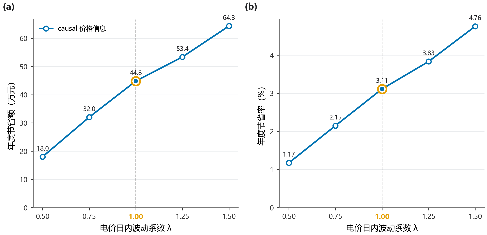

图15 电价波动强度与滚动调整节约

图注：仅比较因果价格条件下的五组既有情形，日均价格保持不变。

## 8 模型检验

预测误差按决策时已生成的预测与随后出现的实际观测计算。设对应评价样本数为$M$，则

$$
\mathrm{MAE}=\frac1M\sum_{j=1}^M|\widehat P_j-P_j|,\qquad
\mathrm{RMSE}=\sqrt{\frac1M\sum_{j=1}^M(\widehat P_j-P_j)^2}. \tag{20}
$$

光伏夜间大量为零，采用MAE和RMSE避免百分比误差的分母问题；各次发布均在当日剩余时段评价。

| 检验项目 | 结果 | 结论范围 |
| --- | --- | --- |
| 问题一原记录最大平衡残差 | $2.27\times10^{-13}$ kWh | 给定确定性实例 |
| 问题二至四原记录最大平衡残差 | $2.27\times10^{-13}$ kWh | 主方案实际运行 |
| 独立重算电量平衡最大残差 | $4.55\times10^{-13}$ kWh | 全部23份缓存 |
| 独立重算SOC递推最大残差 | $9.09\times10^{-13}$ kWh | 全部23份缓存 |
| 储电量物理范围 | 1200—10800 kWh | 主方案及已计算对照 |
| 问题二至四时段充放电上限 | 833.3333 kWh | 微网侧 |
| 同时充放电时段数 | 0 | 实际运行轨迹 |
| 跨日储电量 | 连续衔接 | 含1月预热段 |
| 工作簿购电量与缓存最大差 | $4.55\times10^{-13}$ kWh | 四份统计期结果 |
| 波动试验每日均价最大误差 | $1.23\times10^{-15}$ 元/kWh以内 | 五种波动情形 |

表29 实际运行与数值结果核验

已有数值检查中，电量平衡与SOC递推残差均低于$10^{-12}$ kWh，跨日状态连续，统计期费用与工作簿一致。表中数值均在未舍入结果上汇总后保留相应精度。

问题一的线性规划解没有同时充放电；问题二至四的实际执行规则按供需缺口的符号选择充电或放电，实际轨迹的同时充放电时段数为0。

## 9 模型评价与应用建议

### 9.1 模型优点

模型以日前承诺、付费调整和实时供电三个环节组织决策，将五倍紧急购电成本与储能容量、功率约束纳入同一费用框架。配对历史残差保留负载与光伏的共同波动，跨日SOC连续传递，使费用评价包含前一日储能决策的影响。

预报更新既用误差曲线评价，也用费用与紧急购电量检验；价格对照统一实际结算环境，便于区分购电时点调整与价格信息的作用。

### 9.2 模型不足与可行改进

问题一与后续各问的功率上限计量侧不同，设备应用时需按铭牌明确对应边界。十日残差与固定裕度对极端偏差的覆盖有限，两阶段补救也比真实逐时信息更充分；增加多年度样本可检验场景与裕度的适用性。

光伏比例修正在6时和12时放大平均误差，可考虑按历史表现设置启用条件；电价比例修正仅调整整体水平，峰谷移动仍是其主要误差来源。

模型以购电费用为目标，未计入寿命衰减及设备扩容成本，终端电量按0.42元/kWh计值。因而容量试验用于分析购电费对运行边界的响应，设备投资还需结合寿命与造价。

### 9.3 调控结论

在给定计量约定下，问题一可用线性规划得到日内闭合的购电与储能计划，费用为35101.57元。负载和光伏不确定时，残差场景与因果储能调度给出可执行日前计划；增加日内调整后，统计期总费用由1370.17万元降至1326.66万元，紧急购电量由12.79万kWh降至2.12万kWh。

以所比较方案的费用为主要目标，可选12、18时调整；完整追索主方案比该方案减少约1.19万kWh紧急购电，代价是增加约11.08万元。波动电价下，因果滚动方案较对应日前方案节约44.83万元。调控时应根据应急购电容忍程度选择更新方式，并结合储能余量执行。

## 参考文献

[1] OLIVARES D E, MEHRIZI-SANI A, ETEMADI A H, et al. Trends in microgrid control[J]. IEEE Transactions on Smart Grid, 2014, 5(4): 1905–1919. DOI: [10.1109/TSG.2013.2295514](https://doi.org/10.1109/TSG.2013.2295514).

[2] BIRGE J R, LOUVEAUX F. Introduction to Stochastic Programming[M]. 2nd ed. New York: Springer, 2011. DOI: [10.1007/978-1-4614-0237-4](https://doi.org/10.1007/978-1-4614-0237-4).

[3] PALMA-BEHNKE R, BENAVIDES C, LANAS F, et al. A microgrid energy management system based on the rolling horizon strategy[J]. IEEE Transactions on Smart Grid, 2013, 4(2): 996–1006. DOI: [10.1109/TSG.2012.2231440](https://doi.org/10.1109/TSG.2012.2231440).

[4] HYNDMAN R J, ATHANASOPOULOS G. Forecasting: Principles and Practice[M/OL]. 3rd ed. Melbourne: OTexts, 2021[2026-09-13]. [在线版本](https://otexts.com/fpp3/).

[5] VIRTANEN P, GOMMERS R, OLIPHANT T E, et al. SciPy 1.0: fundamental algorithms for scientific computing in Python[J]. Nature Methods, 2020, 17(3): 261–272. DOI: [10.1038/s41592-019-0686-2](https://doi.org/10.1038/s41592-019-0686-2).

[6] HUANGFU Q, HALL J A J. Parallelizing the dual revised simplex method[J]. Mathematical Programming Computation, 2018, 10(1): 119–142. DOI: [10.1007/s12532-017-0130-5](https://doi.org/10.1007/s12532-017-0130-5).

## 附录 A 支撑材料文件清单与结果说明

题面要求的完整144时段结果见result1.xlsx、result2.xlsx、result3.xlsx、result4-2.xlsx、result4-3.xlsx。问题二至四覆盖2月1日至12月31日，问题三与问题四之三同时保存0时计划和更新后的购电量。正文按题面表1—3保留指定时段购电、四小时充放电、首末储电量和紧急购电结果，完整逐时明细见对应工作簿。

支撑材料统一保存于backing_material.zip，包含76个文件，完整清单见表A1，所有路径均相对压缩包根目录。完整Python程序位于根目录run_all.py、plot_style.py及src目录，依赖清单为requirements-final.txt。根目录的五份Excel为已填结果，data/附件/附件5目录中的同名文件为空白输出模板。复现时应解压至独立目录，按说明.md及原运行入口执行。

正文使用new_figures_main中的全部14幅结果图，以及1幅模型关系流程图。同名PNG和PDF为同一幅图的不同格式，排版优先采用已有PDF；问题一容量灵敏度使用原PNG。各图的统计期均为2025年2—12月，代表日为2025-09-23（问题一采用附件1典型日）。

表A1 支撑材料文件清单

| 文件名 | 用途 |
|---|---|
| FINAL_DELIVERY_AUDIT.md | 原清单程序需要的历史来源记录；不作为本次打包验收结论 |
| SOURCE_HASHES.md | 原清单程序需要的历史来源记录；不作为本次打包验收结论 |
| c建模说明与结果.txt | 建模说明的旧名称兼容副本，供原清单脚本读取 |
| data/附件/附件1.xlsx | 题目原始输入附件；保持原文件及原属性不变 |
| data/附件/附件2.xlsx | 题目原始输入附件；保持原文件及原属性不变 |
| data/附件/附件3.xlsx | 题目原始输入附件；保持原文件及原属性不变 |
| data/附件/附件4.xlsx | 题目原始输入附件；保持原文件及原属性不变 |
| data/附件/附件5/result1.xlsx | 附件5空白输出模板，仅供程序生成结果使用 |
| data/附件/附件5/result2.xlsx | 附件5空白输出模板，仅供程序生成结果使用 |
| data/附件/附件5/result3.xlsx | 附件5空白输出模板，仅供程序生成结果使用 |
| data/附件/附件5/result4-2.xlsx | 附件5空白输出模板，仅供程序生成结果使用 |
| data/附件/附件5/result4-3.xlsx | 附件5空白输出模板，仅供程序生成结果使用 |
| new_figures_main/Q1_F1_optimal_dispatch.png | 现有计算结果图，保留原图 |
| new_figures_main/Q1_F2_solution_diagnostics.png | 现有计算结果图，保留原图 |
| new_figures_main/Q1_F3_storage_sensitivity.png | 现有计算结果图，保留原图 |
| new_figures_main/Q2_F1_typical_dispatch.png | 现有计算结果图，保留原图 |
| new_figures_main/Q2_F2_uncertainty_scenarios.png | 现有计算结果图，保留原图 |
| new_figures_main/Q2_F3_annual_risk_profile.png | 现有计算结果图，保留原图 |
| new_figures_main/Q3_F1_rolling_timeline.png | 现有计算结果图，保留原图 |
| new_figures_main/Q3_F2_forecast_improvement.png | 现有计算结果图，保留原图 |
| new_figures_main/Q3_F3_strategy_pareto.png | 现有计算结果图，保留原图 |
| new_figures_main/Q3_F4_plan_evolution.png | 现有计算结果图，保留原图 |
| new_figures_main/Q4_F1_information_value.png | 现有计算结果图，保留原图 |
| new_figures_main/Q4_F2_price_forecast_update.png | 现有计算结果图，保留原图 |
| new_figures_main/Q4_F3_price_dispatch_coupling.png | 现有计算结果图，保留原图 |
| new_figures_main/Q4_F4_rolling_gain_sensitivity.png | 现有计算结果图，保留原图 |
| plot_style.py | 模型绘图所需的自定义样式模块 |
| requirements-final.txt | 原正式计算环境依赖版本 |
| result1.xlsx | 题面指定的已填完整结果工作簿；必须提交 |
| result2.xlsx | 题面指定的已填完整结果工作簿；必须提交 |
| result3.xlsx | 题面指定的已填完整结果工作簿；必须提交 |
| result4-2.xlsx | 题面指定的已填完整结果工作簿；必须提交 |
| result4-3.xlsx | 题面指定的已填完整结果工作簿；必须提交 |
| results/problem1.json | 逐日、典型日、消融、预测误差或灵敏度计算结果 |
| results/problem1_sensitivity.csv | 逐日、典型日、消融、预测误差或灵敏度计算结果 |
| results/problem2.json | 逐日、典型日、消融、预测误差或灵敏度计算结果 |
| results/problem2_daily.csv | 逐日、典型日、消融、预测误差或灵敏度计算结果 |
| results/problem3.json | 逐日、典型日、消融、预测误差或灵敏度计算结果 |
| results/problem3_ablation.csv | 逐日、典型日、消融、预测误差或灵敏度计算结果 |
| results/problem3_daily.csv | 逐日、典型日、消融、预测误差或灵敏度计算结果 |
| results/problem3_forecast_accuracy.csv | 逐日、典型日、消融、预测误差或灵敏度计算结果 |
| results/problem4.json | 逐日、典型日、消融、预测误差或灵敏度计算结果 |
| results/problem4_causal_q2_daily.csv | 逐日、典型日、消融、预测误差或灵敏度计算结果 |
| results/problem4_causal_q3_daily.csv | 逐日、典型日、消融、预测误差或灵敏度计算结果 |
| results/problem4_comparison.csv | 逐日、典型日、消融、预测误差或灵敏度计算结果 |
| results/problem4_fixed_q2_daily.csv | 逐日、典型日、消融、预测误差或灵敏度计算结果 |
| results/problem4_fixed_q3_daily.csv | 逐日、典型日、消融、预测误差或灵敏度计算结果 |
| results/problem4_oracle_q2_daily.csv | 逐日、典型日、消融、预测误差或灵敏度计算结果 |
| results/problem4_oracle_q3_daily.csv | 逐日、典型日、消融、预测误差或灵敏度计算结果 |
| results/problem4_perfect_information_daily.csv | 逐日、典型日、消融、预测误差或灵敏度计算结果 |
| results/problem4_price_forecast_accuracy.csv | 逐日、典型日、消融、预测误差或灵敏度计算结果 |
| results/problem4_price_volatility_sensitivity.csv | 逐日、典型日、消融、预测误差或灵敏度计算结果 |
| results/problem4_price_volatility_sensitivity.json | 逐日、典型日、消融、预测误差或灵敏度计算结果 |
| run_all.py | 原模型完整运行入口 |
| src/audit_q3_forecast_alignment.py | 模型、出图或正式运行入口所需的验证与结果导出程序 |
| src/audit_timestamp_alignment.py | 模型、出图或正式运行入口所需的验证与结果导出程序 |
| src/build_final_manifest.py | 模型、出图或正式运行入口所需的验证与结果导出程序 |
| src/build_summary.py | 模型、出图或正式运行入口所需的验证与结果导出程序 |
| src/config.py | 模型、出图或正式运行入口所需的验证与结果导出程序 |
| src/dispatch_core.py | 模型、出图或正式运行入口所需的验证与结果导出程序 |
| src/plot_main_figures.py | 模型、出图或正式运行入口所需的验证与结果导出程序 |
| src/problem1.py | 模型、出图或正式运行入口所需的验证与结果导出程序 |
| src/problem2.py | 模型、出图或正式运行入口所需的验证与结果导出程序 |
| src/problem3.py | 模型、出图或正式运行入口所需的验证与结果导出程序 |
| src/problem4.py | 模型、出图或正式运行入口所需的验证与结果导出程序 |
| src/problem4_sensitivity.py | 模型、出图或正式运行入口所需的验证与结果导出程序 |
| src/reporting.py | 模型、出图或正式运行入口所需的验证与结果导出程序 |
| src/result_workbooks.py | 模型、出图或正式运行入口所需的验证与结果导出程序 |
| src/scenario_cache.py | 模型、出图或正式运行入口所需的验证与结果导出程序 |
| src/test_c_spec.py | 模型、出图或正式运行入口所需的验证与结果导出程序 |
| src/test_timestamp_alignment.py | 模型、出图或正式运行入口所需的验证与结果导出程序 |
| src/time_axis.py | 模型、出图或正式运行入口所需的验证与结果导出程序 |
| src/validate_typical_days.py | 模型、出图或正式运行入口所需的验证与结果导出程序 |
| 说明.md | 文件关系、环境、运行与结果解释 |
| 文件清单.md | 本清单 |
| SHA256SUMS.txt | 除自身外所有文件的完整性校验值 |
